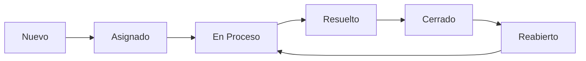

# 🎯 Feature: Flujo Completo de Resolución de Tickets

## 📋 Descripción General

Esta funcionalidad implementa el flujo completo desde que un técnico marca un ticket como resuelto hasta que un administrador lo cierra, incluyendo la capacidad de reabrir tickets cerrados.

---

## 🔄 Flujo de Estados del Ticket



### **Estados del Ticket**
1. **Nuevo** (status_id: 1) - Ticket recién creado
2. **Asignado** (status_id: 2) - Ticket asignado a un técnico
3. **En Proceso** (status_id: 3) - Técnico trabajando en el ticket
4. **Resuelto** (status_id: 5) - Técnico marcó como resuelto (esperando cierre de admin)
5. **Cerrado** (status_id: 6) - Admin cerró definitivamente el ticket
6. **Reabierto** (status_id: 7) - Admin reabrió el ticket cerrado

---

## 🛠️ Implementación Backend

### **1. Nuevos Endpoints**

#### **POST /api/tickets/:id/resolve**
- **Descripción**: Marca un ticket como resuelto (técnico asignado)
- **Autenticación**: Requerida (JWT)
- **Permisos**: 
  - Solo técnico ASIGNADO al ticket
  - Admin puede resolver cualquier ticket
- **Validaciones**:
  - Ticket debe estar en estado "En Proceso" (status_id: 3)
  - Comentario de resolución obligatorio (mínimo 10 caracteres)
  - Ticket debe tener al menos 1 comentario previo
- **Request Body**:
```json
{
  "resolution_comment": "Se reemplazó el cable de red defectuoso. Sistema funcionando correctamente."
}
```
- **Response (200)**:
```json
{
  "success": true,
  "message": "Ticket marcado como resuelto exitosamente",
  "data": {
    "id": 1,
    "status_id": 5,
    "resolved_at": "2025-01-20T10:30:00.000Z",
    "resolved_by": 2,
    ...
  }
}
```

#### **POST /api/tickets/:id/close**
- **Descripción**: Cierra un ticket (solo admin)
- **Autenticación**: Requerida (JWT)
- **Permisos**: Solo administradores
- **Validaciones**:
  - Ticket debe estar en estado "Resuelto" (status_id: 5)
- **Request Body**:
```json
{
  "close_reason": "Cliente confirmó que el problema fue resuelto satisfactoriamente"
}
```
- **Response (200)**:
```json
{
  "success": true,
  "message": "Ticket cerrado exitosamente",
  "data": {
    "id": 1,
    "status_id": 6,
    "closed_at": "2025-01-20T11:00:00.000Z",
    "closed_by": 1,
    ...
  }
}
```

#### **POST /api/tickets/:id/reopen**
- **Descripción**: Reabre un ticket cerrado (solo admin)
- **Autenticación**: Requerida (JWT)
- **Permisos**: Solo administradores
- **Validaciones**:
  - Ticket debe estar en estado "Cerrado" (status_id: 6)
  - Razón de reapertura obligatoria (mínimo 10 caracteres)
- **Request Body**:
```json
{
  "reopen_reason": "El cliente reportó que el problema volvió a ocurrir"
}
```
- **Response (200)**:
```json
{
  "success": true,
  "message": "Ticket reabierto exitosamente",
  "data": {
    "id": 1,
    "status_id": 7,
    "reopened_at": "2025-01-20T12:00:00.000Z",
    "reopened_by": 1,
    "resolved_at": null,
    "closed_at": null,
    ...
  }
}
```

---

## 🎨 Implementación Frontend

### **1. TicketDetail.jsx - Botones de Acción**

#### **Tarjeta de Acciones**
Se agregó una nueva tarjeta "Acciones" en la columna derecha que contiene:

1. **Botón "Marcar como Resuelto"** (verde)
   - **Visible para**: Técnico asignado + Admin
   - **Condición**: Ticket en estado "En Proceso" (status_id === 3)
   - **Funcionalidad**: Abre modal de resolución

2. **Botón "Cerrar Ticket"** (azul)
   - **Visible para**: Solo Admin
   - **Condición**: Ticket en estado "Resuelto" (status_id === 5)
   - **Funcionalidad**: Abre modal de cierre

3. **Botón "Reabrir Ticket"** (naranja)
   - **Visible para**: Solo Admin
   - **Condición**: Ticket en estado "Cerrado" (status_id === 6)
   - **Funcionalidad**: Abre modal de reapertura

#### **Permisos (Variables Calculadas)**
```javascript
const canResolve = (user?.role === 'tecnico' && ticket.assigned_to === user?.id && ticket.status_id === 3) || 
                   (user?.role === 'admin' && ticket.status_id === 3);
const canClose = user?.role === 'admin' && ticket.status_id === 5;
const canReopen = user?.role === 'admin' && ticket.status_id === 6;
```

### **2. Modales de Diálogo**

#### **Modal "Marcar como Resuelto"**
- **Campos**:
  - `resolutionComment` (obligatorio, mínimo 10 caracteres, máximo 500)
  - `evidenceFile` (opcional, permite adjuntar evidencia)
- **Validaciones**:
  - Comentario debe tener mínimo 10 caracteres
  - Contador de caracteres en tiempo real
  - Botón "Marcar como Resuelto" deshabilitado hasta cumplir validaciones
- **Flujo**:
  1. Usuario ingresa comentario de resolución
  2. Opcionalmente adjunta evidencia (foto, documento)
  3. Click en "Marcar como Resuelto"
  4. Si hay evidencia, se sube primero
  5. Se marca como resuelto con el comentario
  6. Se recarga el ticket
  7. Se muestra alerta de éxito

#### **Modal "Cerrar Ticket"**
- **Campos**:
  - `closeReason` (opcional, máximo 300 caracteres)
- **Flujo**:
  1. Admin confirma cierre del ticket
  2. Opcionalmente ingresa razón de cierre
  3. Click en "Cerrar Ticket"
  4. Se cierra el ticket
  5. Se recarga el ticket
  6. Se muestra alerta de éxito

#### **Modal "Reabrir Ticket"**
- **Campos**:
  - `reopenReason` (obligatorio, mínimo 10 caracteres, máximo 300)
- **Validaciones**:
  - Razón debe tener mínimo 10 caracteres
  - Contador de caracteres en tiempo real
- **Flujo**:
  1. Admin ingresa razón de reapertura
  2. Click en "Reabrir Ticket"
  3. Se reabre el ticket a estado "Reabierto"
  4. Se limpian fechas de resolución y cierre
  5. Se recarga el ticket
  6. Se muestra alerta de éxito

### **3. TicketList.jsx - Botón de Acción Rápida**

#### **Botón "Marcar como Resuelto"**
- **Ubicación**: Debajo del botón "Aceptar" en cada tarjeta de ticket
- **Visible para**: 
  - Técnico asignado (ticket.assigned_to === user.id)
  - Admin
- **Condición**: Ticket en estado "En Proceso" (status_id === 3)
- **Funcionalidad**: Navega a `/tickets/:id#resolve` (detalle del ticket con auto-apertura del modal)
- **Estilo**: Botón verde full-width con hover effect

---

## 📊 Validaciones y Reglas de Negocio

### **Validaciones de Estado**
| Acción | Estado Requerido | Nuevo Estado | Error si... |
|--------|------------------|--------------|-------------|
| Resolver | En Proceso (3) | Resuelto (5) | Ticket no está "En Proceso" |
| Cerrar | Resuelto (5) | Cerrado (6) | Ticket no está "Resuelto" |
| Reabrir | Cerrado (6) | Reabierto (7) | Ticket no está "Cerrado" |

### **Validaciones de Permisos**
| Acción | Rol | Condición Adicional |
|--------|-----|---------------------|
| Resolver | Técnico | Debe ser el técnico asignado (ticket.assigned_to === user.id) |
| Resolver | Admin | Sin restricciones |
| Cerrar | Admin | Solo admin |
| Reabrir | Admin | Solo admin |

### **Validaciones de Contenido**
| Campo | Validación |
|-------|------------|
| `resolution_comment` | Obligatorio, mínimo 10 caracteres, máximo 500 |
| `close_reason` | Opcional, máximo 300 caracteres |
| `reopen_reason` | Obligatorio, mínimo 10 caracteres, máximo 300 |
| Comentarios previos | Ticket debe tener al menos 1 comentario antes de resolver |

---

## 🧪 Casos de Prueba

### **Test 1: Técnico Resuelve Ticket**
1. Login como técnico (usuario: `tecnico1`, pass: `tecnico123`)
2. Abrir ticket asignado en estado "En Proceso"
3. Click en "Marcar como Resuelto" (botón verde)
4. Ingresar comentario: "Problema resuelto correctamente"
5. (Opcional) Adjuntar evidencia
6. Click en "Marcar como Resuelto" en el modal
7. ✅ **Esperado**: Ticket cambia a estado "Resuelto", comentario agregado, alerta de éxito

### **Test 2: Admin Cierra Ticket**
1. Login como admin (usuario: `admin`, pass: `admin123`)
2. Abrir ticket en estado "Resuelto"
3. Click en "Cerrar Ticket" (botón azul)
4. Ingresar razón: "Cliente confirmó resolución"
5. Click en "Cerrar Ticket" en el modal
6. ✅ **Esperado**: Ticket cambia a estado "Cerrado", comentario interno agregado, alerta de éxito

### **Test 3: Admin Reabre Ticket**
1. Login como admin
2. Abrir ticket en estado "Cerrado"
3. Click en "Reabrir Ticket" (botón naranja)
4. Ingresar razón: "Problema volvió a ocurrir"
5. Click en "Reabrir Ticket" en el modal
6. ✅ **Esperado**: Ticket cambia a estado "Reabierto", fechas limpiadas, comentario interno agregado

### **Test 4: Validaciones de Permisos**
1. Login como técnico que NO está asignado al ticket
2. Abrir ticket en estado "En Proceso" de otro técnico
3. ✅ **Esperado**: NO se muestra botón "Marcar como Resuelto"
4. Login como técnico
5. Abrir ticket en estado "Resuelto"
6. ✅ **Esperado**: NO se muestran botones "Cerrar" o "Reabrir" (solo admin)

### **Test 5: Validaciones de Contenido**
1. Login como técnico
2. Click en "Marcar como Resuelto"
3. Ingresar solo 5 caracteres en comentario
4. ✅ **Esperado**: Botón "Marcar como Resuelto" deshabilitado, error mostrado
5. Completar a 10+ caracteres
6. ✅ **Esperado**: Botón habilitado, sin error

### **Test 6: Acción Rápida en TicketList**
1. Login como técnico
2. Ir a lista de tickets
3. Ver ticket asignado en estado "En Proceso"
4. ✅ **Esperado**: Botón verde "Marcar como Resuelto" visible
5. Click en botón
6. ✅ **Esperado**: Navega a detalle del ticket (posibilidad de auto-abrir modal)

---

## 🔧 Archivos Modificados

### **Backend**
- `src/controllers/ticketController.js` - 3 nuevos controladores
- `src/services/ticketService.js` - 3 nuevas funciones de negocio
- `src/routes/tickets.js` - 3 nuevas rutas

### **Frontend**
- `src/services/ticketService.js` - 3 nuevas funciones API
- `src/pages/tickets/TicketDetail.jsx` - Botones y modales de acción
- `src/pages/tickets/TicketList.jsx` - Botón de acción rápida

---

## 📝 Notas Técnicas

### **Campos Agregados en Modelo Ticket**
```javascript
resolved_at: DATE,      // Fecha cuando se marcó como resuelto
resolved_by: INTEGER,   // ID del usuario que resolvió
closed_at: DATE,        // Fecha cuando se cerró
closed_by: INTEGER,     // ID del usuario que cerró
reopened_at: DATE,      // Fecha cuando se reabrió
reopened_by: INTEGER    // ID del usuario que reabrió
```

### **Campos Agregados en Modelo Comment**
```javascript
is_resolution: BOOLEAN,  // Comentario de resolución
is_closure: BOOLEAN,     // Comentario de cierre
is_reopening: BOOLEAN    // Comentario de reapertura
```

### **Registros en Historial**
- Cada acción (resolver, cerrar, reabrir) crea un comentario automático
- Los comentarios de cierre y reapertura son internos (`is_internal: true`)
- El comentario de resolución es público (visible para el cliente)

---

## 🎨 Paleta de Colores UI

| Acción | Color Primario | Hover | Disabled |
|--------|---------------|-------|----------|
| **Resolver** | Green-600 (#16A34A) | Green-700 (#15803D) | Green-300 (#86EFAC) |
| **Cerrar** | Blue-600 (#2563EB) | Blue-700 (#1D4ED8) | Blue-300 (#93C5FD) |
| **Reabrir** | Orange-600 (#EA580C) | Orange-700 (#C2410C) | Orange-300 (#FDBA74) |

---

## ✅ Checklist de Implementación

- [x] Backend: Endpoint `/api/tickets/:id/resolve`
- [x] Backend: Endpoint `/api/tickets/:id/close`
- [x] Backend: Endpoint `/api/tickets/:id/reopen`
- [x] Backend: Validaciones de estado y permisos
- [x] Backend: Validación de comentarios mínimos
- [x] Frontend: Servicio API para resolver/cerrar/reabrir
- [x] Frontend: Botones de acción en TicketDetail
- [x] Frontend: Modal de resolución con evidencia opcional
- [x] Frontend: Modal de cierre (admin)
- [x] Frontend: Modal de reapertura (admin)
- [x] Frontend: Validaciones de permisos calculadas
- [x] Frontend: Botón de acción rápida en TicketList
- [x] Documentación completa
- [ ] Pruebas end-to-end del flujo completo

---

## 📞 Soporte

Para dudas o problemas con esta funcionalidad, consultar:
- `/Docs/DEVELOPMENT-RULES.md` - Reglas generales del proyecto
- `/Docs/POSTMAN-ENDPOINTS.md` - Documentación de endpoints
- `/Docs/COMPONENT-STRUCTURE.md` - Estructura de componentes

---

**Autor**: Sistema de Gestión de Tickets MAC  
**Fecha**: Enero 2025  
**Versión**: 1.0.0

